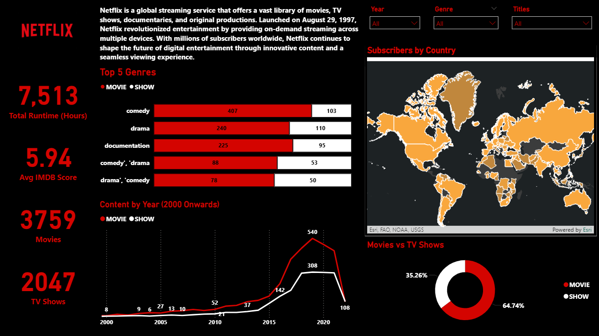

# 🍿 Netflix Content Visualization

This Power BI project was created as part of the Microsoft Power BI Certification from Brain4ce Education Solutions Pvt. Ltd.

The dashboard analyzes a Netflix dataset, connecting information from IMDB and TMDB to visualize content across genres, years, and countries of origin.

---

## 📊 Key Features

- Top 5 genres by type (bar chart)
- Content release trends by year and type (line chart)
- Runtime and production countries on a world map
- Distribution of content types (donut chart)
- Cards for total runtime, content count, and IMDb average score
- Genre, year, and title slicers for interactive filtering
- Branding: Netflix logo and company intro

---

## 📁 Files Included

| File Name                          | Description                          |
|-----------------------------------|--------------------------------------|
| `Module4_Visualization_Project.pbix` | Power BI report file              |
| `images/netflix_visualization.png`   | Dashboard screenshot              |
| `README.md`                          | This documentation file           |

---


## 🧮 DAX Measures Used

```dax
Total Content = COUNTROWS(Title)

Runtime Hours = SUM(Title[Runtime]) / 60

